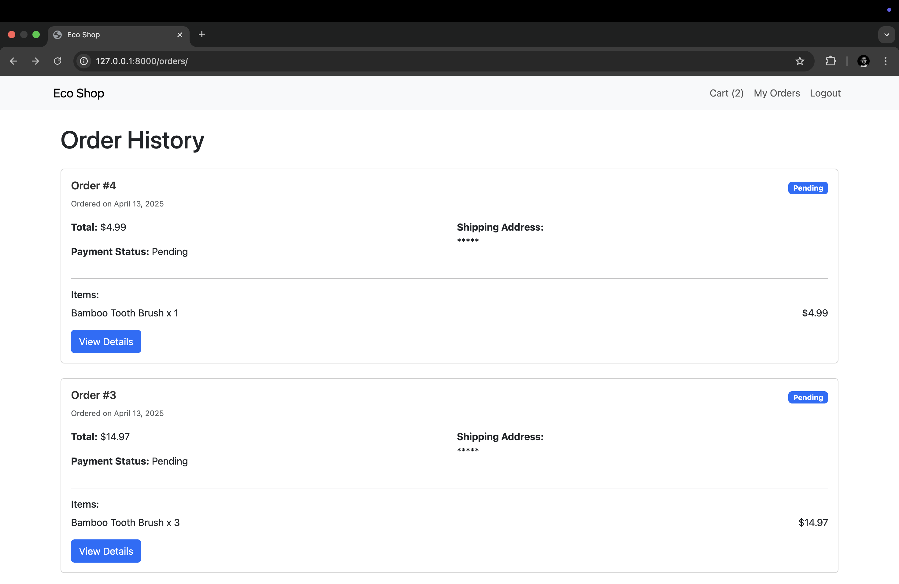

# Eco Shop - Sustainable E-commerce Platform

A Django-based e-commerce platform focused on eco-friendly products. This project demonstrates a full-featured online store with user authentication, shopping cart functionality, and order management.

## Features

- User Authentication (Login/Register)
- Product Catalog
- Shopping Cart Management
- Order History and Tracking
- Admin Dashboard
- Responsive Design

## Screenshots

### 1. Homepage

The main product listing page showing all available eco-friendly products.

### 2. Shopping Cart

View and manage items in your shopping cart.

### 3. Order History

Track your past orders and their status.

### 4. Order Details

Detailed view of a specific order with items and status.

### 5. Login Page

Secure user authentication page.

## Installation

1. Clone the repository:
```bash
git clone https://github.com/Prashant2204/DjangoEShop.git
cd DjangoEShop
```

2. Create and activate virtual environment:
```bash
python -m venv .venv
source .venv/bin/activate  # On Windows: .venv\Scripts\activate
```

3. Install dependencies:
```bash
pip install -r requirements.txt
```

4. Set up environment variables:
Create a `.env` file in the project root with:
```
SECRET_KEY=your_secret_key
```

5. Run migrations:
```bash
python manage.py migrate
```

6. Create superuser:
```bash
python manage.py createsuperuser
```

7. Run the development server:
```bash
python manage.py runserver
```

## Usage

1. Access the admin panel at `/admin` to manage products and orders
2. Browse products on the homepage (`/`)
3. Add items to cart (`/add-to-cart/<product_id>/`)
4. View cart (`/cart/`)
5. View order history (`/orders/`)

## Technologies Used

- Django
- Django REST Framework
- Bootstrap
- SQLite

## Contributing

1. Fork the repository
2. Create a feature branch
3. Commit your changes
4. Push to the branch
5. Create a Pull Request